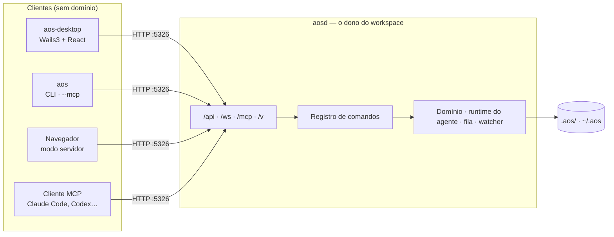

<div align="center">

```
     █████╗  ██████╗ ███████╗
    ██╔══██╗██╔═══██╗██╔════╝
    ███████║██║   ██║███████╗
    ██╔══██║██║   ██║╚════██║
    ██║  ██║╚██████╔╝███████║
    ╚═╝  ╚═╝ ╚═════╝ ╚══════╝
```

**Um sistema operacional para agentes de IA.**

[](https://github.com/VS-7/AOS/actions/workflows/ci.yml)
[](https://github.com/VS-7/AOS/releases/latest)
[](go.mod)
[](LICENSE)

[Instalar](#instalar) · [Primeiro uso](#primeiro-uso) · [Documentação](docs/README.md) · [Agentes de código](docs/system/07-agentes-de-codigo.md) · [Releases](https://github.com/VS-7/AOS/releases)

</div>

---

Você define agentes — cada um com papel, instruções, memória e permissões
próprias — e eles trabalham no seu repositório. Cada tarefa roda isolada em
um worktree do Git; cada decisão vira memória que sobrevive à sessão; cada
capacidade é a **mesma definição** publicada como comando de terminal, tool
MCP, rota HTTP e tela do aplicativo.

Tudo fica na sua máquina, em Markdown, versionável junto com o código. Não há
serviço no meio.

> **Beta.** Binários sem assinatura de desenvolvedor e sem atualização
> automática. [O que isso muda](docs/system/08-operacao.md#limitações-do-beta).

## Por que

| | |
|---|---|
| **Continuidade** | Memória persistente com grafo, confiança calibrada e um *subconsciente* que forma memórias sozinho. Agentes lembram entre sessões — e entre instâncias paralelas. |
| **Isolamento** | Cada tarefa executa em um worktree próprio. Nada é sobrescrito enquanto você continua trabalhando. |
| **Uma definição, cinco superfícies** | CLI, MCP, HTTP, tool interna do agente e documentação derivam de um único registro de comandos. Nada diverge. |
| **Contenção** | Sandbox por *allowlist*, aprovação humana real para ações sensíveis, segredos com permissão restrita, loopback por padrão. |
| **Seu disco, seu Git** | Agentes, tarefas, memórias e coleções são arquivos `.md`/`.json` em `.aos/` dentro do repositório. |

## O que dá para fazer

| | |
|---|---|
| **Agentes** | Papel, instruções, modelo, sandbox e canais por agente. Um orquestrador delega a especialistas. |
| **Tarefas** | Ciclo de vida de 8 estados, *todos* com evidência, comentários, worktree por tarefa. |
| **Conversas** | DMs, canais, threads de tarefa, transcrições de execução — com anexos e streaming. |
| **Rotinas** | Automações por agenda, por webhook ou por gatilho de atividade. |
| **Coleções e views** | Registros estruturados em Markdown + `schema.json`, com interfaces declarativas sobre eles. |
| **Skills, toolsets e marketplace** | Capacidades declaradas e permissionadas, ferramentas externas (OpenAPI, MCP), plugins prontos para instalar. |
| **Metas, projetos, artefatos** | O que os agentes perseguem, como se agrupa, e o que publicam (apps estáticos servidos pelo daemon). |
| **Fora da janela** | Telegram, Cloudflare Tunnel, e qualquer cliente MCP. |

## Instalar

**macOS e Linux**

```sh
curl -fsSL https://raw.githubusercontent.com/VS-7/AOS/main/install.sh | sh
```

**Windows** — baixe `AOS-setup-<versão>-windows-amd64.exe` em
[Releases](https://github.com/VS-7/AOS/releases/latest).

**Servidor (VPS), sem interface gráfica** — o daemon carrega a interface e
você acessa pelo navegador:

```sh
curl -fsSL https://raw.githubusercontent.com/VS-7/AOS/main/install.sh | AOS_SERVER=1 sh
systemctl --user enable --now aos && loginctl enable-linger "$USER"
```

📖 [Guia de instalação completo](INSTALL.md) — requisitos por distribuição,
AppImage, checksums, variáveis do instalador, solução de problemas.

## Primeiro uso

1. Abra o aplicativo. Ele sobe o daemon e pede para criar a conta local.
2. Aponte para um repositório: ele vira o workspace, com um `.aos/` dentro.
3. Converse com o **Atlas**, o orquestrador padrão — ou crie o seu.

O terminal funciona sem login separado:

```sh
aos agents list
aos tasks create --set title="Revisar o README" --reason "primeira tarefa"
aos --help                 # a árvore inteira de comandos, vinda do daemon
```

## Use com o seu agente de código

O AOS ensina qualquer agente — Claude Code, Codex, Cursor, Gemini CLI,
OpenCode — a operá-lo, por **skill** e por **MCP**:

```sh
aos self skill install --all     # a skill, em cada agente detectado na máquina
aos --mcp                        # servidor MCP em stdio, roteado ao daemon
```

Ou, para clientes que falam HTTP: `http://127.0.0.1:5326/mcp` com o seu token.
Detalhes em [Agentes de código](docs/system/07-agentes-de-codigo.md).

## Como é montado



Três programas: **`aosd`** (o daemon, único escritor), **`aos`** (terminal e
MCP) e **`aos-desktop`** (a janela). Tudo passa por HTTP, então o cliente
não precisa estar na mesma máquina que o daemon.

## Documentação

| | |
|---|---|
| [Visão geral](docs/system/01-visao-geral.md) | O problema, o produto, conceitos e glossário |
| [Requisitos](docs/system/02-requisitos.md) | Requisitos funcionais, não funcionais e restrições |
| [Casos de uso](docs/system/03-casos-de-uso.md) | Atores, fluxos e diagramas de sequência |
| [Arquitetura](docs/system/04-arquitetura.md) | Binários, camadas, fluxo de uma chamada, dados em disco |
| [Domínio](docs/system/05-dominio.md) | Entidades, estados, relações e onde cada coisa vive |
| [Canais](docs/system/06-canais.md) | App, terminal, navegador, MCP, Telegram, webhooks, túnel |
| [Agentes de código](docs/system/07-agentes-de-codigo.md) | Skill e MCP para Claude Code, Codex, Cursor, Gemini, OpenCode |
| [Operação](docs/system/08-operacao.md) | Instalação, estado, variáveis, segurança, diagnóstico |
| [Desenvolvimento](docs/system/09-desenvolvimento.md) | Build, gates, layout, como adicionar um comando |
| [Release](docs/system/10-release.md) | Versionamento, CI, artefatos, checksums |
| [Vault de especificação](docs/00%20-%20Índice/AOS.md) | 82 notas de engenharia: ADRs, peças críticas, um doc por domínio |

## Contribuir

```sh
task check        # todos os gates: gen, vet, lint, testes (-race), cobertura, arquitetura, grafo
task dev          # a janela, com hot reload
```

O [guia de desenvolvimento](docs/system/09-desenvolvimento.md) tem o resto.
Agentes de código que trabalham *neste* repositório leem [AGENTS.md](AGENTS.md).

## Licença

[MIT](LICENSE).
