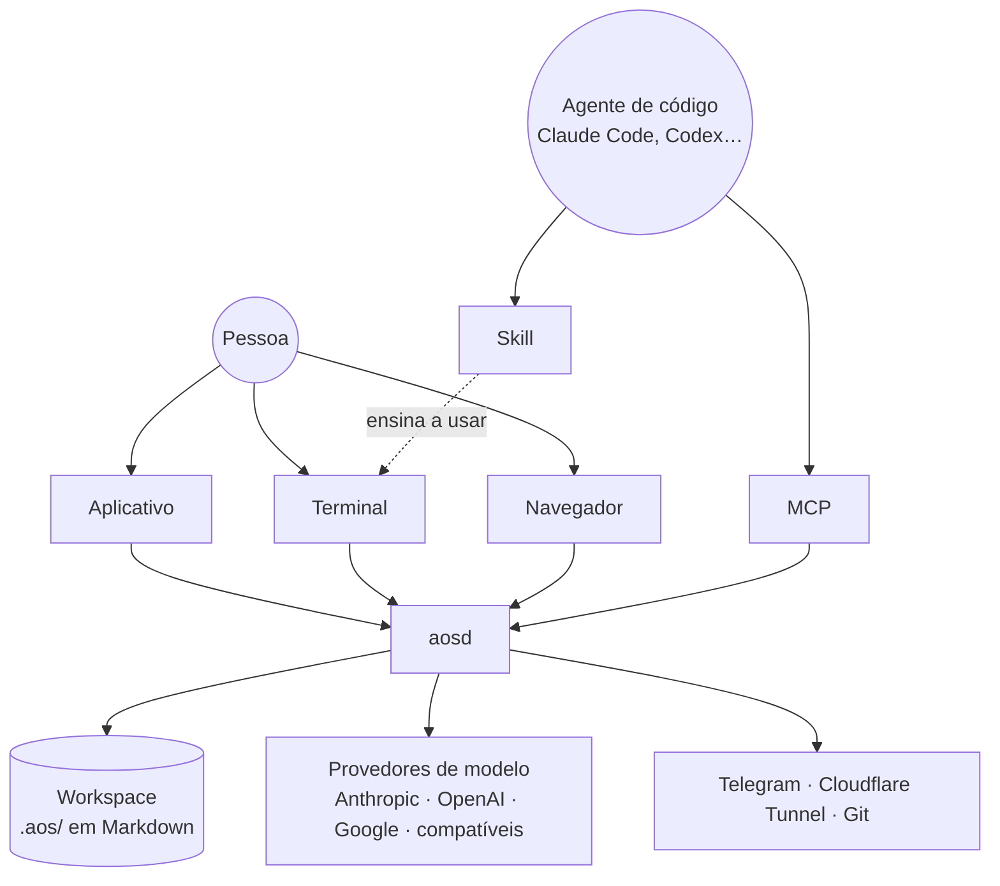

# 01 · Visão geral

> [Índice da documentação](../README.md) · Próximo: [Requisitos](02-requisitos.md)

## O problema

Um agente de IA que trabalha em código hoje começa cada sessão do zero: não
sabe o que foi decidido ontem, não sabe o que os outros agentes estão fazendo,
sobrescreve o que você está editando, e cada ferramenta que ele pode usar é
exposta de um jeito diferente para cada cliente. Continuidade, isolamento e
uma superfície coerente ficam por conta de quem o opera.

## O produto

**AOS** (*Agent Operating System*) é a camada de infraestrutura que dá a
agentes **memória persistente**, **execução com ciclo de vida** e
**continuidade entre sessões** — instalada na máquina da pessoa, sobre o
próprio repositório, sem serviço no meio.

Ele é um daemon local (`aosd`) que possui um *workspace* (um diretório com
`.aos/` dentro, normalmente um repositório Git) e o expõe por quatro
superfícies: um aplicativo desktop, um terminal, uma API HTTP e um servidor
MCP. Quem usa escolhe a porta de entrada; o que está atrás é o mesmo.



## Para quem

| Perfil | O que ganha |
|---|---|
| **Desenvolvedor individual** | Agentes que lembram do projeto, executam tarefas em worktrees isolados e não atrapalham o trabalho em andamento. |
| **Equipe pequena** | Um workspace versionado no Git: agentes, memórias, tarefas e coleções viajam com o código e passam por revisão como ele. |
| **Quem já usa um agente de código** | Claude Code, Codex, Cursor, Gemini CLI ou OpenCode ganham memória, tarefas e delegação através da skill e do MCP. |
| **Quem opera um servidor** | O mesmo daemon roda headless numa VPS e serve a interface no navegador, atrás de um proxy reverso ou de um túnel. |

## As três coisas que definem o produto

1. **Uma definição, cinco superfícies.** Cada capacidade é um `Command` no
   registro. Dele derivam o comando de terminal, a tool MCP, a rota HTTP, a
   tool interna do agente e a documentação. Nada é escrito duas vezes; nada
   diverge.
2. **Prompt com níveis de confiança.** O contexto que o agente recebe é XML
   com `trust="trusted|observed|unverified"` por bloco. É a defesa contra
   *prompt injection* embutida no próprio formato.
3. **O subconsciente.** Um segundo modelo observa as conversas e forma
   memórias sozinho, tirando a memória do caminho crítico do agente
   principal. É o que faz a continuidade acontecer sem ninguém pedir.

## Modelo mental

```
A pessoa fala → um Agente com identidade persistente recebe o pedido →
monta contexto a partir de Workspace + Memória + Skills + Instruções →
executa Tools (a mesma definição do terminal) →
que chamam serviços de domínio →
que gravam Markdown no repositório →
que alimentam o contexto da próxima sessão.
```

O nome desse ciclo fechado é **continuidade**.

## Vocabulário

| Termo | Significado |
|---|---|
| **Workspace** | Um diretório (normalmente um repositório Git) com `.aos/` dentro. O daemon pode servir vários; cada chamada diz a qual se refere. |
| **Agente** | Identidade persistente: nome, papel, instruções (Markdown), modelo, sandbox, canais. Um deles é o **orquestrador** (padrão: *Atlas*). |
| **Memória** | Um traço com categoria (decisão, fato, preferência, erro…), confiança (0–1), links a outras memórias e ciclo de vida (ativa, depreciada, arquivada, expirada). Global entre instâncias paralelas do mesmo agente. |
| **Subconsciente** | O processo que forma memórias a partir das conversas sem intervenção do agente principal. |
| **Chat** | Uma conversa: DM, canal, thread de tarefa, transcrição de execução ou externa (Telegram). |
| **Tarefa** | Trabalho com ciclo de vida de 8 estados, *todos* (passos com evidência), comentários e worktree Git próprio. |
| **Todo** | Um passo de uma tarefa. Fechar exige evidência; `in_review` exige todos fechados. |
| **Rotina** | Automação de um agente disparada por agenda, webhook ou atividade do workspace. Cada disparo é um **run**. |
| **Meta / Projeto** | O que os agentes perseguem e como o trabalho se agrupa. |
| **Skill** | Capacidade instalável: instruções, agentes, coleções, views e hooks, com permissões declaradas. Também: a skill que o **AOS publica** para ensinar agentes a usá-lo. |
| **Toolset** | Ferramenta externa (API OpenAPI, servidor MCP) que um agente pode chamar. |
| **Coleção / View** | Registros estruturados (Markdown + `schema.json`) e interfaces declarativas sobre eles. |
| **Artefato** | Um app estático publicado pelo daemon (`/v/artifacts/...`) com visibilidade privada, do workspace ou por senha. |
| **Instrução** | Política do workspace, injetada no prompt; mudanças de escopo amplo passam por aprovação humana. |
| **Template** | Texto Liquid renderizado com dados do workspace. |
| **Marketplace** | Registros (git/http) de plugins e skills prontos para instalar. |
| **Gateway** | O supervisor do daemon: `aos gateway start\|stop\|status\|restart`. |
| **Túnel** | Exposição do daemon na internet via Cloudflare Tunnel. |
| **Bot** | Presença de um agente fora da interface (Telegram) por webhook. |
| **Sandbox** | Política de execução por *allowlist* de binários, `denyArgs` e opt-in de shell. |
| **Aprovação** | Uma ação sensível pergunta a um humano de verdade quando há canal; em modo headless a negação é imediata. |
| **Spillover** | Resultado de tool grande demais vai para o disco e o agente recebe um ponteiro, não o conteúdo. |

## O que o AOS não é

- **Não é um serviço.** Não há conta na nuvem, não há telemetria obrigatória,
  não há dado seu fora da sua máquina a não ser o que você manda ao provedor
  de modelo que escolheu.
- **Não é um editor.** Ele orquestra; o editor e o agente de código que você
  já usa continuam sendo os seus.
- **Não é um framework de agentes.** Não há SDK para escrever agentes em
  código: um agente é um arquivo Markdown com frontmatter.

> Próximo: [02 · Requisitos](02-requisitos.md)
