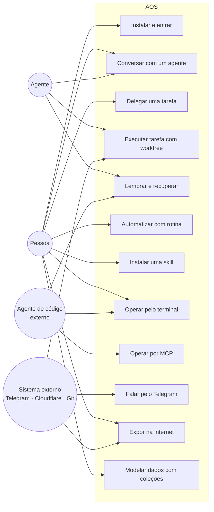
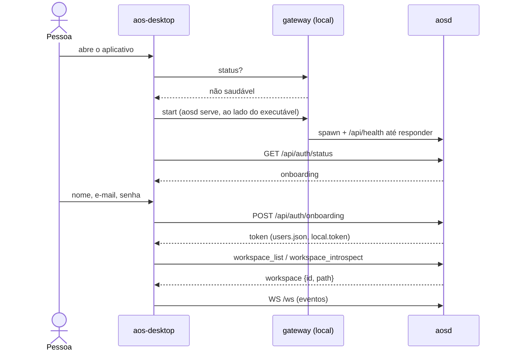
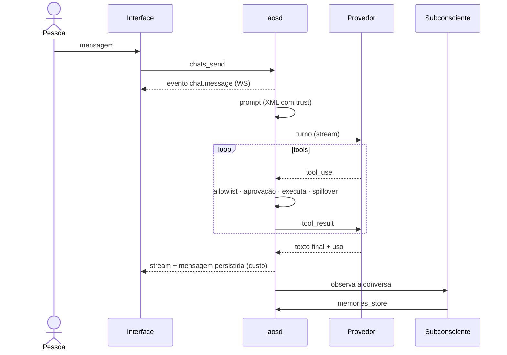
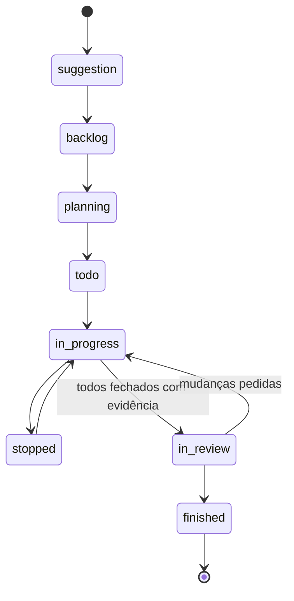
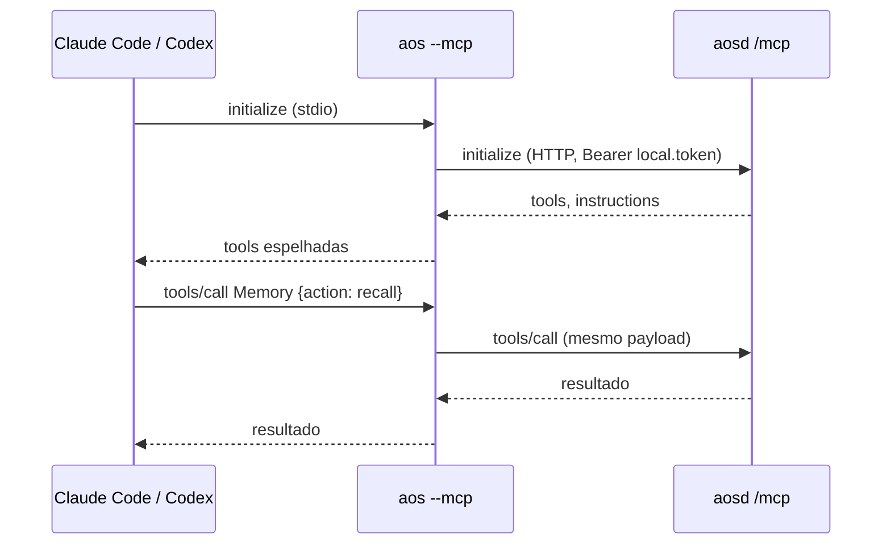

# 03 · Casos de uso

> [Índice](../README.md) · Anterior: [Requisitos](02-requisitos.md) · Próximo: [Arquitetura](04-arquitetura.md)

## Atores

## Mapa

| ID | Caso de uso | Ator principal | Requisitos |
|---|---|---|---|
| [UC-01](#uc-01--instalar-e-entrar) | Instalar e entrar | Pessoa | RF-01, RF-03, RF-04, RF-73 |
| [UC-02](#uc-02--conversar-com-um-agente) | Conversar com um agente | Pessoa, Agente | RF-30–RF-35 |
| [UC-03](#uc-03--delegar-uma-tarefa) | Delegar uma tarefa | Pessoa | RF-40, RF-43 |
| [UC-04](#uc-04--executar-uma-tarefa-em-um-worktree) | Executar uma tarefa em um worktree | Agente | RF-41, RF-42, RF-44 |
| [UC-05](#uc-05--lembrar-e-recuperar) | Lembrar e recuperar | Agente | RF-20–RF-22 |
| [UC-06](#uc-06--automatizar-com-uma-rotina) | Automatizar com uma rotina | Pessoa | RF-50–RF-52 |
| [UC-07](#uc-07--instalar-uma-skill) | Instalar uma skill | Pessoa | RF-60, RF-62, RF-63 |
| [UC-08](#uc-08--operar-pelo-terminal) | Operar pelo terminal | Pessoa, Agente externo | RF-72 |
| [UC-09](#uc-09--operar-por-mcp-a-partir-de-um-agente-de-código) | Operar por MCP a partir de um agente de código | Agente externo | RF-71, RF-77 |
| [UC-10](#uc-10--falar-com-um-agente-pelo-telegram) | Falar com um agente pelo Telegram | Pessoa, Telegram | RF-75, RF-76 |
| [UC-11](#uc-11--expor-o-daemon-na-internet) | Expor o daemon na internet | Pessoa | RF-74, RF-76, RNF-04 |
| [UC-12](#uc-12--modelar-dados-com-coleções-e-views) | Modelar dados com coleções e views | Pessoa, Agente | RF-62, RF-63 |
| [UC-13](#uc-13--aprovar-uma-ação-sensível) | Aprovar uma ação sensível | Pessoa | RF-33 |
| [UC-14](#uc-14--publicar-um-artefato) | Publicar um artefato | Agente | RF-64 |

---

## UC-01 · Instalar e entrar

**Ator:** Pessoa. **Pré-condição:** nenhuma. **Pós-condição:** daemon rodando,
conta criada, um workspace aberto na janela.

1. A pessoa roda o instalador (`curl … | sh`) ou o instalador do Windows.
2. Abre o aplicativo. Ele resolve `~/.aos`, pergunta ao gateway se o daemon
   está de pé e, se não, inicia o `aosd` que está ao lado do executável.
3. A janela abre antes de o daemon responder e mostra a criação de conta
   (`/api/auth/status` diz *onboarding*).
4. A pessoa cria a conta. O daemon grava `users.json` e `local.token`
   (ambos `0600`) e devolve um token; a janela o guarda.
5. O aplicativo lista os workspaces registrados; sem nenhum, pede ao daemon
   para `introspect` o diretório que ele mesmo escolheu, ou o diretório do
   projeto se foi aberto de dentro de um.
6. O workspace é semeado (`.aos/`, *Atlas*, `git init` se preciso) e a
   janela entra nele, no idioma do sistema.

**Alternativas.** 2a. Linux sem GTK4/WebKitGTK: o binário nomeia a
biblioteca que falta e sai. 5a. A janela foi aberta de um diretório que
pode ser um projeto (`CanHoldWorkspace`): esse diretório é registrado.

## UC-02 · Conversar com um agente

**Ator:** Pessoa; Agente. **Pré-condição:** UC-01; um provedor de modelo
configurado. **Pós-condição:** turno persistido no chat, custo registrado,
memórias possivelmente formadas.

1. A pessoa escreve numa DM ou canal (com anexos e menções, se quiser).
2. `chats_send` persiste a mensagem e enfileira um turno para o agente
   destinatário (ou o orquestrador).
3. O runner monta o prompt (workspace, memórias recuperadas, skills,
   instruções — cada bloco com `trust`), chama o provedor e faz streaming de
   texto pelo WebSocket.
4. Quando o modelo pede uma tool, o executor valida contra a allowlist do
   agente, executa (com spillover se o resultado é grande) e devolve.
5. A resposta é persistida com o custo; o subconsciente observa a conversa
   e grava o que aprendeu como memória.

## UC-03 · Delegar uma tarefa

**Ator:** Pessoa. **Pré-condição:** UC-01. **Pós-condição:** tarefa criada em
`.aos/tasks/<id>/TASK.md`, atribuída, no estado escolhido.

1. No board ou no terminal (`aos tasks create`), a pessoa descreve a tarefa,
   escolhe agente, projeto/meta e se quer worktree (`--worktree`, `--base`).
2. O sistema cria a tarefa (`suggestion` ou `backlog`), com plano vazio.
3. A pessoa (ou o orquestrador) move para `planning` → `todo` por
   `set-status`; o agente adiciona *todos*.
4. Ao mover para `in_progress` o worker pega a tarefa (UC-04).

**Regras.** Estados: `suggestion, backlog, planning, todo, in_progress,
stopped, in_review, finished`. `update` nunca muda o estado; só `set-status`.

## UC-04 · Executar uma tarefa em um worktree

**Ator:** Agente (worker). **Pré-condição:** tarefa em `in_progress` com
`worktree` ligado. **Pós-condição:** tarefa em `in_review` com todos os
*todos* fechados com evidência e comentários de progresso.

1. O worker cria `git worktree add` numa branch a partir de `base`.
2. Abre um chat do tipo `run` e executa o loop do agente confinado ao
   worktree (sandbox do agente).
3. A cada passo, fecha o *todo* correspondente com evidência
   (`tasks_todos_set-status`) e comenta o progresso.
4. Tenta `in_review`; o sistema recusa se houver *todo* pendente.
5. Ao finalizar (`finished`), o worktree é removido; a branch fica.

## UC-05 · Lembrar e recuperar

**Ator:** Agente (ou agente externo pela skill). **Pré-condição:** identidade
conhecida (`agents_me`).

1. Início de sessão: `agents_me` → `memories_recall` (limite 20) →
   `workspace_introspect`.
2. Antes de gravar, recupera: se já há traço, `supersede` ou linka em vez de
   duplicar.
3. Grava com categoria, confiança calibrada (0.9–1.0 verificado, 0.6–0.8
   inferência forte, < 0.6 palpite), TTL opcional e links.
4. Antes de entregar uma resposta final, mover uma tarefa para `in_review`
   ou concluir uma rotina, reflete e atualiza memórias.

## UC-06 · Automatizar com uma rotina

**Ator:** Pessoa. **Pós-condição:** rotina em `.aos/agents/<id>/routines/<id>/ROUTINE.md`; cada disparo em `runs/`.

1. A pessoa cria a rotina para um agente com um gatilho: `scheduled`
   (expressão cron), `webhook` (o sistema mostra a URL) ou `activity`
   (padrão de evento do workspace, p. ex. `task.status_changed`).
2. O daemon agenda (fila SQLite) ou registra o gatilho.
3. Ao disparar, um `run` é criado, o agente executa em um chat `run` e o
   resultado fica registrado; falhas ficam visíveis no run.

## UC-07 · Instalar uma skill

**Ator:** Pessoa. **Pós-condição:** `.aos/skills/<nome>/` com agentes,
coleções, views e instruções da skill registrados e visíveis.

1. `aos skills install <caminho|git|http>` ou pelo marketplace.
2. O sistema lê `SKILL.md` e o manifesto de permissões, recusa escrita fora
   do diretório da skill e registra o que ela traz (agentes, coleções,
   views, hooks).
3. O watcher vê `schema.json` novos e registra coleções sem reiniciar.
4. Desinstalar remove tudo que a skill trouxe e nada além.

## UC-08 · Operar pelo terminal

**Ator:** Pessoa ou agente externo.

1. `aos <grupo> <comando> [--json | --set caminho=valor]... --reason "…"`.
2. O `aos` descobre a árvore no daemon (`/api/_commands`, 3 s) e envia
   `POST /api/<grupo>/<comando>` com o token de `~/.aos/local.token` (ou
   `AOS_TOKEN`) e o workspace de `AOS_WORKSPACE_ID`.
3. A saída segue `--format` (JSON para programas, texto para humanos), com
   `--token-limit/--token-offset` para paginar por tokens e `--count-tokens`
   para medir antes de pedir.
4. Erros chegam com código e *call to action*; o status de saída é ≠ 0.

## UC-09 · Operar por MCP a partir de um agente de código

**Ator:** Claude Code, Codex, Cursor, Gemini CLI, OpenCode… **Pré-condição:**
UC-01; skill instalada (`aos self skill install`).

1. O cliente MCP lança `aos --mcp` (stdio) **ou** conecta em
   `http://127.0.0.1:5326/mcp` com `Authorization: Bearer <token>`.
2. `aos --mcp` garante o daemon de pé (inicia se preciso), conecta ao `/mcp`
   dele com o token local e espelha as tools em stdio.
3. O agente lê a skill: `agents_me`, `memories_recall`,
   `workspace_introspect`; nas tools compostas, `schema: true` na primeira
   chamada de cada ação.
4. Cada chamada leva `_reasoning`; o daemon valida, executa e responde.

## UC-10 · Falar com um agente pelo Telegram

**Ator:** Pessoa (no Telegram). **Pré-condição:** túnel ativo (UC-11) e um
agente com canal `telegram` configurado (token do bot).

1. O daemon registra o webhook do bot em
   `<url pública>/api/bot/telegram/webhook/<agente>` com um segredo.
2. Uma mensagem chega; o daemon confere o segredo, encontra (ou cria) o chat
   `external` desse `chat_id`, e enfileira o turno.
3. A resposta do agente é entregue de volta pela API do Telegram, dividida no
   limite de tamanho e com rate limit.

## UC-11 · Expor o daemon na internet

**Ator:** Pessoa. **Pré-condição:** `security.enabled = true`.

- **Proxy reverso** (VPS): `aosd` do pacote *server* escuta em
  `127.0.0.1:5326` e serve a interface; Caddy/Nginx termina TLS na frente. A
  primeira página pede a criação da conta; até existir, nada mais responde.
- **Cloudflare Tunnel**: `aos tunnel start` sobe o `cloudflared` gerenciado
  pelo daemon e publica a URL; é a mesma URL que bots e webhooks usam.
- Em ambos, o daemon **recusa** subir fora do loopback com autenticação
  desligada (`SERVER_EXPOSED_WITHOUT_AUTH`).

## UC-12 · Modelar dados com coleções e views

**Ator:** Pessoa ou agente ("monte um CRM").

1. Cria `.aos/collections/<nome>/schema.json` (ou `collections_create`).
2. O watcher registra a coleção; registros são `.md` com frontmatter validado
   pelo schema; a busca os indexa.
3. Uma view declarativa (`views_create`) descreve a interface com
   componentes do catálogo; a UI a renderiza sobre os registros.

## UC-13 · Aprovar uma ação sensível

**Ator:** Pessoa. **Gatilho:** um agente chama uma tool marcada como
sensível ou fora da política.

1. O daemon publica `approval.requested` no canal em tempo real e espera até
   `AOS_APPROVAL_DEADLINE` (120 s).
2. A pessoa aprova ou nega na interface (`approvals_resolve`).
3. Sem canal disponível (modo headless), a negação é imediata e explícita
   para o agente.

## UC-14 · Publicar um artefato

**Ator:** Agente. **Pós-condição:** um app estático servido em
`/v/artifacts/<id>/`.

1. `artifacts_create` registra o artefato com visibilidade `private`,
   `workspace` ou `by_password`.
2. O agente escreve os arquivos (`index.html`, assets) no diretório do
   artefato.
3. O daemon os serve com autorização própria por artefato — nunca com o
   cookie de sessão da interface.

> Próximo: [04 · Arquitetura](04-arquitetura.md)
