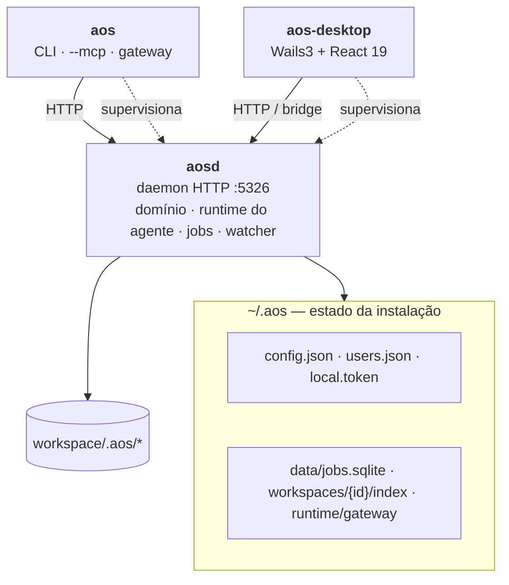
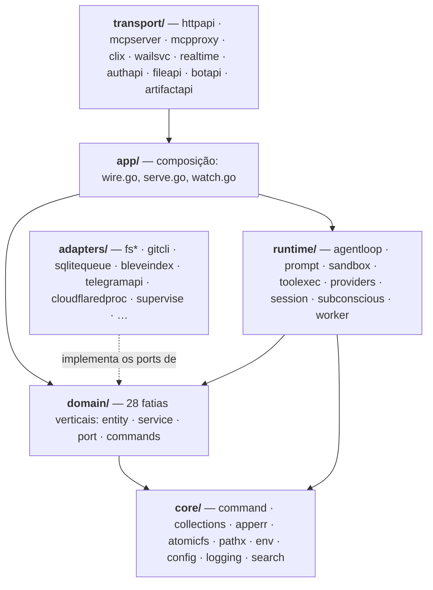
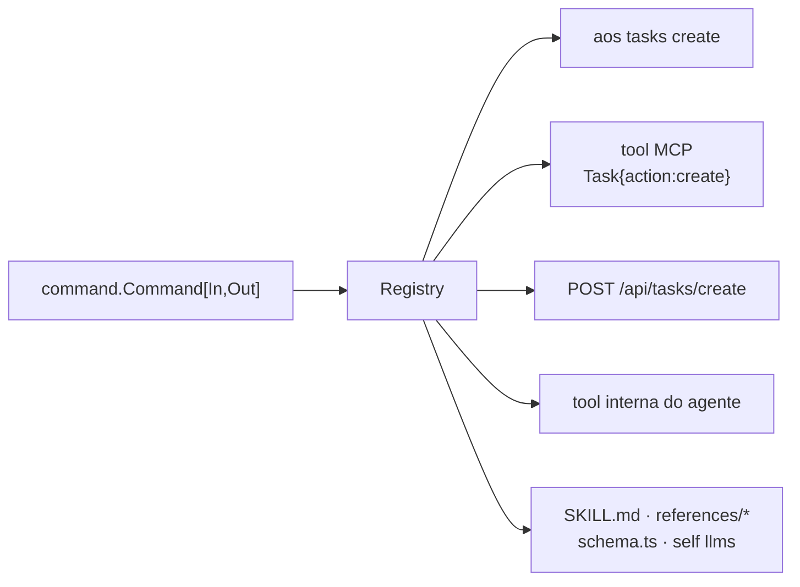
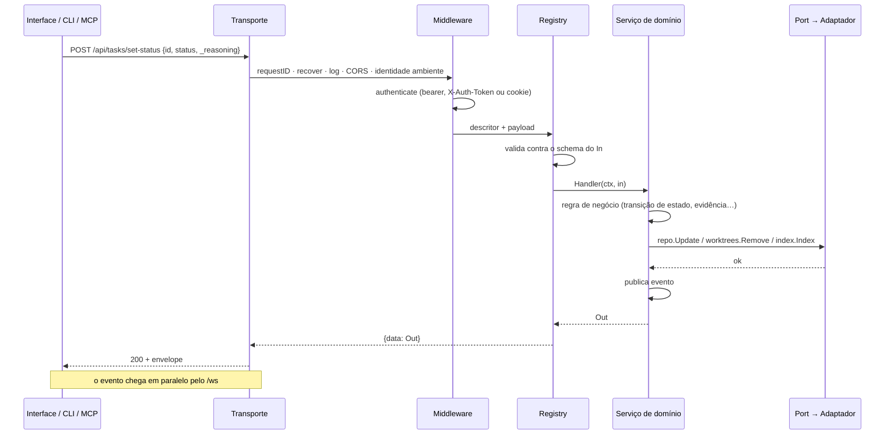
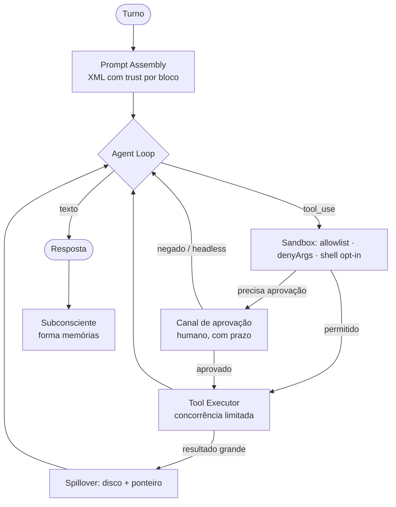
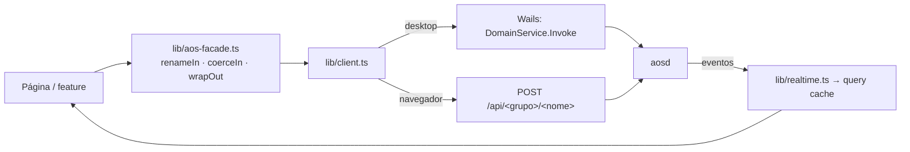

# 04 · Arquitetura

> [Índice](../README.md) · Anterior: [Casos de uso](03-casos-de-uso.md) · Próximo: [Domínio](05-dominio.md)

## Os três binários



| Binário | Contém | Não contém |
|---|---|---|
| **`aosd`** | Domínio completo, runtime do agente, fila de jobs, watcher, transportes HTTP/WS/MCP/artefatos. É o único que escreve no workspace. | Interface (exceto no build `-tags webui`) |
| **`aos`** | Registro local do grupo `gateway`, cliente HTTP, proxy MCP em stdio, árvore de comandos vinda do daemon. | Domínio — exceto `gateway`, local por desenho |
| **`aos-desktop`** | Frontend embutido, services Wails, cliente HTTP, supervisão do gateway. | Domínio |

**A regra de conteúdo é um teste.** `internal/domain` não pode importar
transporte, adaptadores, runtime nem bibliotecas de I/O; `cmd/aos` e
`cmd/aos-desktop` não podem linkar domínio. `TestDependencyRule` e
`TestNoDomainInClients` falham o build quando isso é violado.

Por que um daemon: um workspace tem um dono só. Se cada janela e cada terminal
carregasse o sistema inteiro, todos escreveriam nos mesmos arquivos ao mesmo
tempo. Com um daemon há um escritor e nenhuma disputa — e, como tudo passa por
HTTP, o cliente não precisa estar na mesma máquina.

## Camadas



Hexagonal: o domínio define *ports* (interfaces) e os adaptadores os
implementam. A composição acontece só em `internal/app/wire.go` e em `cmd/`.
Sem framework de injeção — ordem de construção explícita.

## Uma definição, cinco superfícies

O coração é `internal/core/command`. Uma capacidade é declarada uma vez:

```go
command.Command[CreateInput, CreateOutput]{
    Group: "tasks", Name: "create",
    Summary: "Create a task.",
    Registry: true,              // visível como tool do agente
    Handler: svc.Create,
}
```

Disso derivam, sem código adicional:



Regras que isso impõe:

- **Envelope único**: toda resposta é `{data}` ou `{error}` (+ `notice` numa
  renomeação). Um cliente parseia uma estrutura, não duas.
- **`_reasoning` obrigatório** em toda chamada de tool.
- **Renomear preserva o caminho antigo** com um aviso — a integração escrita
  meses atrás não quebra em silêncio (ADR-0011).
- **Documentação derivada**: `frontend/src/lib/schema.ts` e `pkg/skill/` são
  gerados; o CI falha se divergirem do registro.

## O caminho de uma chamada



Um erro segue o mesmo caminho e vira `{error: {code, message, issues,
actions}}` — com o *call to action* que diz qual comando ou tool resolve.

## Superfícies do daemon

| Rota | O que é | Autenticação |
|---|---|---|
| `POST /api/<grupo>/<nome>` | Todo comando do registro | Bearer / cookie (quando `security.enabled`) |
| `GET /api/health` | Sonda do gateway | Aberta, por desenho |
| `GET /api/_commands` | Manifesto que o `aos` usa para montar sua árvore | Autenticada |
| `GET /api/docs` | Schemas de todos os comandos | Autenticada; desligada em produção |
| `/api/auth/*` | Onboarding, login, sessão, logout, contas, senha | Cada rota decide |
| `/api/file/*` | Explorador de arquivos (fora do registro por decisão) | Autenticada |
| `/api/bot/{provider}/webhook/{agente}` | Webhook do Telegram | Segredo do próprio webhook |
| `/ws` | Canal de eventos em tempo real | Bearer / cookie **e** autorização por workspace |
| `/mcp` | MCP streamable HTTP | Mesmo middleware do `/api` |
| `/v/artifacts/{id}/*` | Apps estáticos publicados | Por artefato (privado/workspace/senha) |
| `/*` | A interface (só no build `-tags webui`) | — |

## Runtime do agente



Cinco pontos de intervenção (hooks) no loop, uma sandbox por agente, e o
subconsciente rodando fora do caminho crítico.

**Níveis de confiança no prompt.** Cada bloco carrega
`trust="trusted|observed|unverified"`: instruções do workspace são *trusted*,
o que o agente observou é *observed*, e conteúdo de terceiros — um arquivo do
repositório, o corpo de uma resposta HTTP — é *unverified*. É a defesa contra
*prompt injection* embutida no formato, não uma heurística sobreposta depois.

## Dados em disco

**Global — `~/.aos`** (permissões `0700`, segredos `0600`, auditados no boot):

```
~/.aos/
├── config.json          configuração da instalação
├── users.json           contas e tokens (argon2id)
├── local.token          o credencial do terminal
├── data/jobs.sqlite     fila de jobs
├── runtime/gateway/     gateway.json · gateway.lock · gateway.log
├── runtime/update/      downloads da atualização
├── workspaces/<id>/     registro do workspace + índice Bleve
├── themes/              temas instalados
└── tmp/outputs/         spillover de resultados de tool
```

**Por workspace — `<repo>/.aos`** (Markdown e JSON, versionáveis):

```
.aos/
├── agents/<slug>/AGENT.md            + memories/*.memory.md, routines/<id>/
├── tasks/<id>/TASK.md                + todos, comentários
├── chats/<id>.chat.json
├── collections/<nome>/schema.json    + registros .md
├── views/, skills/, templates/, instructions/, artifacts/
├── goals/<slug>/GOAL.md, projects/<slug>/PROJECT.md
└── activity/AAAA-MM.jsonl            + read.json (cursor)
```

Escrita atômica (rename) sob lock por caminho, com CAS para edições
concorrentes (ADR-0012).

## Multi-workspace

O daemon não é dedicado a um workspace. Cada requisição carrega `workspaceID`
(header `x-workspace-id`, cookie ou `AOS_WORKSPACE_ID`) e um resolvedor monta
o runtime correspondente sob demanda, com cache e `singleflight` — vinte
workers do tick global pedindo ao mesmo tempo constroem o runtime uma vez.

Três serviços são singletons do processo porque guardam estado vivo: `config`,
`tunnel` e `gateway`. Os demais são por workspace.

## Frontend



- `lib/schema.ts` é **gerado** do registro Go: um campo que muda em Go quebra
  o build do frontend, não a tela.
- `lib/command-map.ts` traduz o vocabulário da UI portada para o contrato Go.
- No desktop, comandos vão pela ponte Wails; as duas superfícies que não são
  comandos (`/api/file`, `/api/auth`) vão pela ponte autenticada
  `DomainService.Fetch`, porque a página não tem credencial própria.
- O canal de eventos no desktop é aberto pelo **processo Go** e retransmitido
  como evento de janela: um WebView não abre `ws://` de outra origem a partir
  de um esquema `wails://`.

## Decisões que explicam a forma

| ADR | Decisão |
|---|---|
| [0002](../01%20-%20Decisões/ADR-0002%20Wails3%20no%20lugar%20de%20Electron.md) | Wails3 em vez de Electron — 64 MB contra 578 MB |
| [0003](../01%20-%20Decisões/ADR-0003%20Command%20Layer%20unificada.md) | Command Layer unificada |
| [0004](../01%20-%20Decisões/ADR-0004%20Collections%20em%20Markdown.md) | Coleções em Markdown |
| [0006](../01%20-%20Decisões/ADR-0006%20Allowlist%20no%20sandbox.md) | Allowlist, nunca blocklist |
| [0007](../01%20-%20Decisões/ADR-0007%20Canal%20real%20de%20aprovação%20de%20tool.md) | Aprovação que realmente pergunta |
| [0009](../01%20-%20Decisões/ADR-0009%20Bind%20em%20loopback%20por%20padrão.md) | Loopback por padrão |
| [0011](../01%20-%20Decisões/ADR-0011%20Superfície%20de%20tools%20versionada.md) | Superfície de tools versionada |
| [0012](../01%20-%20Decisões/ADR-0012%20Escrita%20atômica%20e%20lock%20por%20arquivo.md) | Escrita atômica e lock por arquivo |

> Próximo: [05 · Domínio](05-dominio.md)
