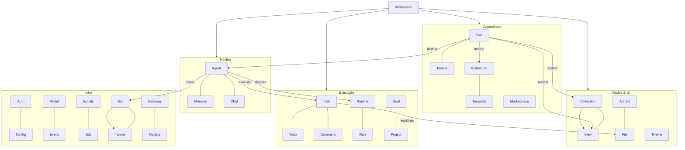
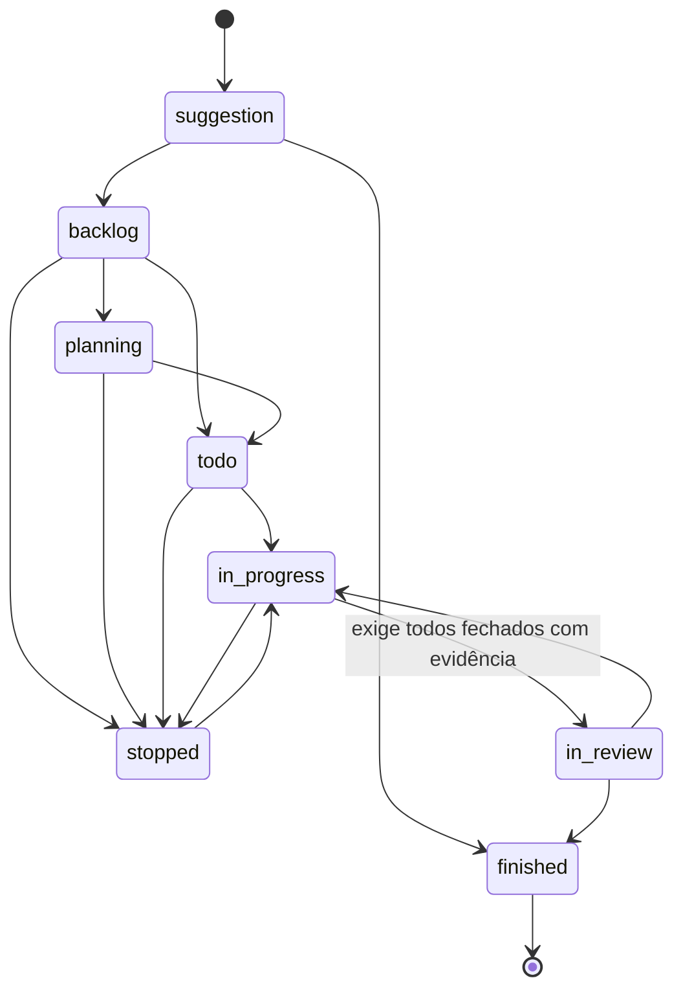
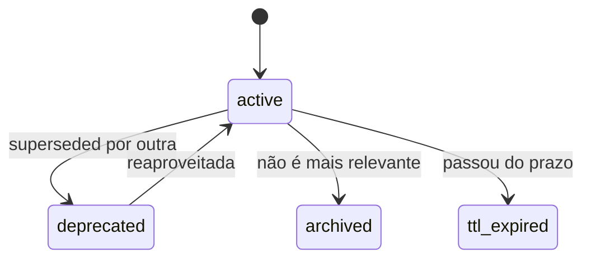
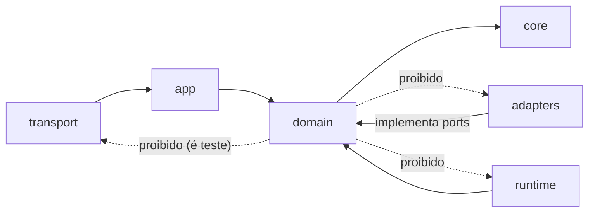

# 05 · Domínio

> [Índice](../README.md) · Anterior: [Arquitetura](04-arquitetura.md) · Próximo: [Canais](06-canais.md)

Trinta e uma fatias verticais em `internal/domain/`. Cada uma tem
`entity.go` (o que é), `service.go` (o que faz), `port.go` (o que precisa) e,
quando publica capacidades, `commands.go`. A regra é verificada por
`TestFeatureLayout`.

## Mapa



## Onde cada coisa vive

Tudo dentro do workspace é Markdown ou JSON, versionável no Git.

| Domínio | Caminho | Estados / ciclo de vida |
|---|---|---|
| **workspace** | `~/.aos/workspaces/{id}/config.json` + `<repo>/.aos/` | registrado · arquivado · desregistrado |
| **agent** | `.aos/agents/{id}/AGENT.md` | sem status; apagar remove memórias, rotinas e eventos |
| **memory** | `.aos/agents/{a}/memories/{id}.memory.md` | `active → deprecated \| archived \| ttl_expired` (nunca apagada) |
| **chat** | `.aos/chats/{id}.chat.json` | run da mensagem: `pending → running → completed \| error \| interrupted` |
| **task** | `.aos/tasks/{id}/TASK.md` | 8 estados (abaixo) |
| **todo** | `.aos/tasks/{t}/todos/{id}.todo.md` | `pending → in_progress → blocked \| finished \| skipped` |
| **comment** | `.aos/tasks/{t}/comments/{id}.comment.md` | thread = comentário raiz + respostas |
| **routine** | `.aos/agents/{a}/routines/{id}/ROUTINE.md` | rotina `enabled \| disabled`; run `running → succeeded \| failed \| timed_out \| skipped` |
| **goal** | `.aos/goals/{id}/GOAL.md` | `active \| achieved \| abandoned \| paused` |
| **project** | `.aos/projects/{id}/PROJECT.md` | `active \| paused \| done \| archived` |
| **skill** | `.aos/skills/{id}/SKILL.md` + o que ela traz | `installed (active\|inactive) → uninstalled` |
| **toolset** | `.aos/toolsets/{id}.toolset.md` | `enabled \| disabled` |
| **collection** | `.aos/collections/{id}/schema.json` + registros `.md` | declarada/atualizada/removida; watcher registra ao aparecer |
| **view** | `.aos/views/{id}.view.json` | — |
| **artifact** | `.aos/artifacts/{id}/` | visibilidade: `private \| workspace \| by_password` |
| **template** | `.aos/templates/{id}.template.md` | — |
| **instruction** | `.aos/instructions/{id}.instruction.md` | `active \| inactive`; escopo amplo passa por aprovação |
| **activity** | `.aos/activity/{AAAA-MM}.jsonl` + `read.json` | append-only; purga por mês |
| **event** | `.aos/agents/{a}/events/{AAAA-MM-DD}.jsonl` | 10 tipos de hook (contrato Claude Code, ADR-0016) |
| **auth** | `~/.aos/users.json` (`0600`), `~/.aos/local.token` | token ativo até revogado ou expirado |
| **config** | `~/.aos/config.json` (`0600`, relido por requisição) | normalização preenche padrões |
| **job** | `~/.aos/data/jobs.sqlite` | `pending → claimed → succeeded \| failed` (backoff 10s–10min) |
| **gateway** | `~/.aos/runtime/gateway/` | `stopped → running`; registro obsoleto é detectado |
| **tunnel** | estado do processo + `config.json` | `stopped → starting → running \| failed` |
| **bot** | registro em memória, montado no boot | `pending → registered \| failed` |
| **update** | `~/.aos/runtime/update` | `check → download (verificado) → apply (com rollback)` |
| **theme** | embutidos + `~/.aos/themes/` | — |
| **model**, **marketplace**, **file** | sem estado próprio | — |

## Tarefa — o ciclo de vida



Regras duras: só `set-status` move uma tarefa (`update` nunca); `in_review`
é recusado enquanto houver *todo* pendente; cada tarefa em execução tem seu
worktree, e o pruner só toca nos worktrees que o próprio workspace criou.

## Memória

Treze categorias — `decision`, `intent`, `commitment`, `relationship`,
`event`, `observation`, `error`, `learning`, `fact`, `reference`,
`instruction`, `preference`, `context` — com confiança 0–1, TTL opcional e
links entre memórias.



Uma memória nunca é apagada: uma depreciação é informação. E memórias são
globais entre instâncias paralelas do mesmo agente — o que uma grava, todas
veem.

## Agente

```yaml
---
name: Atlas
role: Orquestrador
description: Triagem, delegação e roteamento de capacidade.
orchestrator: true
provider: anthropic
model: claude-opus-5
reasoning: medium
sandbox:
  permissions: [read, write, execute]
  exec:
    policy: allowlist
    allow: [git, go, npm]
    denyArgs: ["git push --force*"]
    allowShell: false
channels:
  - provider: telegram
    data: { token: "...", allowedIds: [123456] }
---

Instruções em Markdown, que viram o prompt de sistema do agente.
```

## Eventos em tempo real

Publicados no `/ws`, consumidos pela interface:

| Evento | Carga |
|---|---|
| `activity` | O registro de atividade do workspace |
| `chat.started` | `{chat, agent}` |
| `chat.delta` | `{chat, text, reasoning}` — o streaming |
| `chat.message` | `{chat, message}` — a mensagem inteira |
| `chat.done` | `{chat, agent, usage}` — com o custo do turno |
| `approval.request` | O pedido de aprovação, e depois sua resolução |
| `collection.changed` | `{collection, key, op, path}` — inclusive do watcher |
| `task.changed` | Declarado; hoje as tarefas chegam pelo `activity` |

## Superfície de comandos

27 grupos, 140 comandos. Como cada grupo aparece em cada canal:

| Grupo | CLI | Tool MCP | HTTP |
|---|---|---|---|
| `agents` | `aos agents <cmd>` | `Agent{action}` | `POST /api/agents/<cmd>` |
| `memories` | `aos memories <cmd>` | `Memory{action}` | `POST /api/memories/<cmd>` |
| `tasks` | `aos tasks <cmd>` | `Task{action}` | `POST /api/tasks/<cmd>` |
| … | idem | idem | idem |

Os 27: `activity`, `agents`, `approvals`, `artifacts`, `chats`,
`collections`, `comments`, `config`, `gateway`, `goals`, `instructions`,
`jobs`, `marketplace`, `memories`, `models`, `projects`, `routines`,
`skills`, `tasks`, `templates`, `themes`, `todos`, `toolsets`, `tunnel`,
`update`, `views`, `workspace`.

A lista completa, com o schema de entrada de cada comando:

```sh
aos self llms --full          # ou: aosd self llms --full
```

## Regra de dependência



`internal/domain` não conhece `net/http`, `os/exec`, `database/sql`, chi,
cobra, Wails, MCP, WebSocket, SQLite nem Bleve. Um domínio que precisa de
qualquer um deles declara um *port* e um adaptador o implementa.

> Próximo: [06 · Canais](06-canais.md)
