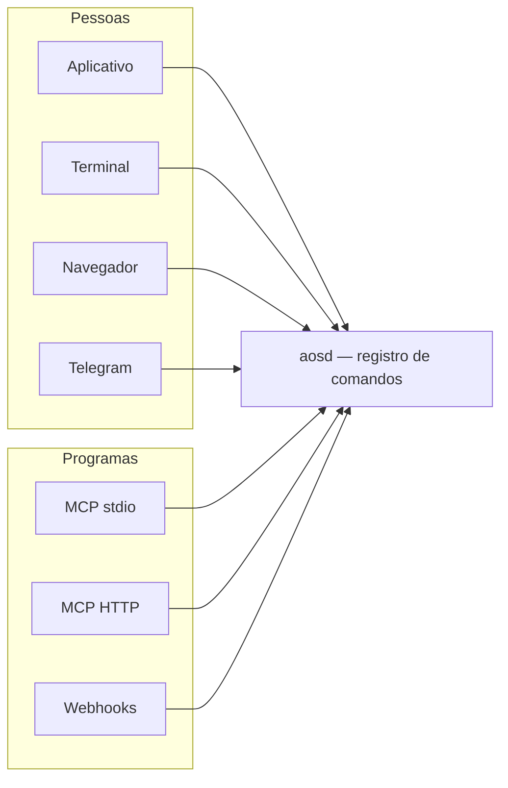
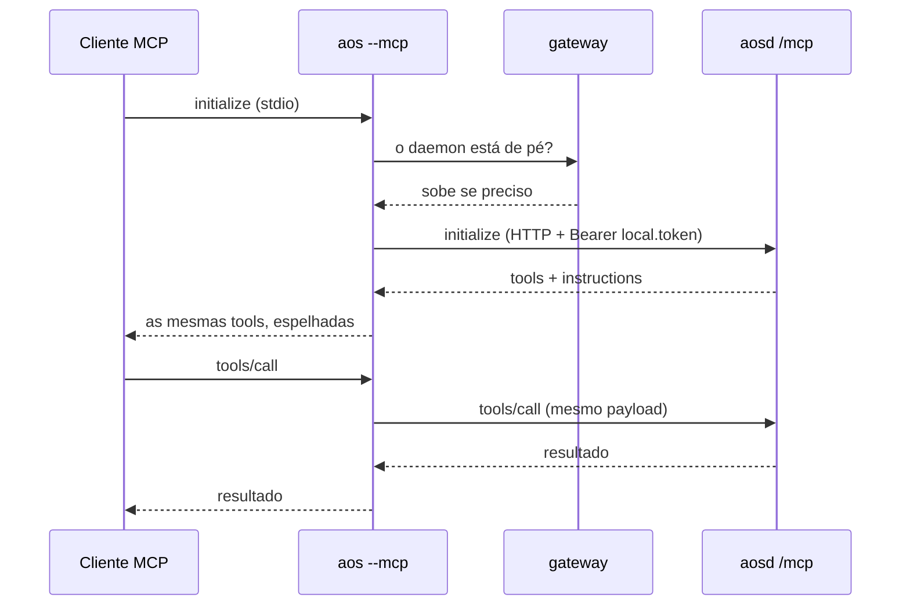

# 06 · Canais

> [Índice](../README.md) · Anterior: [Domínio](05-dominio.md) · Próximo: [Agentes de código](07-agentes-de-codigo.md)

Sete formas de alcançar o mesmo sistema. Todas passam pelo mesmo registro de
comandos no `aosd`, então nenhuma tem uma regra que a outra não tenha.



---

## 1 · Aplicativo (desktop)

**O que é.** Uma janela Wails3 sobre o daemon. macOS (Apple Silicon),
Windows e Linux (x86-64).

**Como fala com o daemon.** Comandos vão pela ponte Wails
(`DomainService.Invoke`), em processo, sem salto de rede — com queda para
HTTP se a ponte não responder. As duas superfícies que não são comandos
(`/api/file`, `/api/auth`) vão pela ponte autenticada `DomainService.Fetch`,
porque a página não tem credencial própria: quem a guarda é o processo Go.

**Ciclo de vida.** A janela abre antes do daemon responder; o gateway sobe o
`aosd` que está **ao lado do executável** (ou em `AOS_DAEMON_PATH`). Se ele
não estiver lá, a interface diz que não alcança o daemon em vez de não abrir.

**Integrações de plataforma.** Diálogos de arquivo, abrir caminho, revelar na
pasta, salvar arquivo (o `<a download>` não funciona num WebView), aparência
nativa da janela sincronizada com o tema, arrastar arquivos para a janela, e
o deep link `aos://`.

**Eventos em tempo real.** O processo Go mantém o WebSocket e retransmite
como evento de janela — um WebView não abre `ws://` para outra origem a
partir de um esquema `wails://`. Ao trocar de workspace, a conexão é
reapontada.

---

## 2 · Terminal (`aos`)

```sh
aos gateway start|stop|status|restart     # local, sempre disponível
aos agents list
aos tasks create --set title="Revisar" --set status=todo --reason "porque"
aos memories recall --set limit=20 --format json
aos self llms --full                      # a superfície inteira
aos self skill install --all
aos self completions zsh
```

**Como a árvore aparece.** O binário `aos` não carrega o domínio. No
arranque ele pergunta ao daemon (`GET /api/_commands`, 3 s) e monta um
comando por entrada. Sem daemon, restam os built-ins e o `gateway` — e, se
você pedir um comando de domínio, o erro diz que a árvore vem do daemon e
como resolver, em vez de "unknown command".

**Entrada.** `--json '<corpo>'`, `--set caminho=valor` (repetível, com o tipo
inferido de JSON), `--reason "…"` para o `_reasoning` obrigatório.

**Saída.** `--format json|text` (JSON quando a saída não é um terminal),
`--filter` para selecionar caminhos, `--token-limit`/`--token-offset` para
paginar por tokens e `--count-tokens` para medir antes de gastar.

**Credencial.** `AOS_TOKEN`, ou `~/.aos/local.token` — escrito uma vez, no
onboarding, como credencial própria do terminal. Sair da conta na janela
**não** derruba o terminal.

---

## 3 · Navegador (modo servidor)

O mesmo `aosd`, compilado com `-tags webui`: a interface vai comprimida
dentro do binário (53 MB de bundle viram 14 MB) e é servida em qualquer
caminho que nenhuma rota reivindique. Uma VPS é um arquivo e um navegador.

```sh
curl -fsSL https://raw.githubusercontent.com/VS-7/AOS/main/install.sh | AOS_SERVER=1 sh
systemctl --user enable --now aos
loginctl enable-linger "$USER"
```

Autenticação por cookie `HttpOnly`. O daemon escuta em `127.0.0.1:5326` e
**recusa** subir fora do loopback com autenticação desligada. Para publicar,
um proxy reverso terminando TLS:

```caddyfile
aos.example.com {
    reverse_proxy 127.0.0.1:5326
}
```

---

## 4 · MCP em stdio (`aos --mcp`)

O que um cliente MCP lança como subprocesso.

```jsonc
{
  "mcpServers": {
    "aos": { "command": "aos", "args": ["--mcp"] }
  }
}
```



Por que um proxy e não o próprio binário servindo as tools: o registro precisa
do domínio, e o domínio mora no daemon — que também precisa continuar sendo o
único processo que escreve no workspace. O proxy dá ao cliente um `command`
para lançar sem duplicar nada.

---

## 5 · MCP em HTTP (`/mcp`)

Para clientes que falam HTTP em vez de lançar processos.

```jsonc
{
  "mcpServers": {
    "aos": {
      "type": "http",
      "url": "http://127.0.0.1:5326/mcp",
      "headers": { "Authorization": "Bearer aos_..." }
    }
  }
}
```

Mesmo middleware de autenticação de todo `/api`. Três formas de superfície,
por `config.mcp.toolShape`:

| Forma | O que publica | Quando |
|---|---|---|
| `composite` (padrão) | Uma tool por grupo, com `action` e `schema: true` | Menos contexto gasto listando tools |
| `flat` | Uma tool por comando (`memories_store`) | Clientes que preferem o modelo simples |
| `both` | As duas | Durante uma migração |

---

## 6 · Telegram

```mermaid
sequenceDiagram
    actor P as Pessoa
    participant T as Telegram
    participant D as aosd
    participant A as Agente
    Note over D,T: no boot, o daemon registra<br/>&lt;url pública&gt;/api/bot/telegram/webhook/&lt;agente&gt;
    P->>T: mensagem
    T->>D: POST webhook + X-Telegram-Bot-Api-Secret-Token
    D->>D: confere o segredo · acha ou cria o chat externo
    D->>A: enfileira o turno
    A-->>D: resposta
    D->>T: sendMessage (dividida em 4000 caracteres)
    T-->>P: resposta
```

Configurado por agente (`channels: [{provider: telegram, data: {token, allowedIds}}]`).
Precisa de uma URL pública — o túnel (abaixo) ou um proxy reverso.

---

## 7 · Webhooks de rotina e túnel

**Rotinas por webhook** recebem uma URL própria; um `POST` nela dispara o
agente e cria um *run*.

**Cloudflare Tunnel** publica o daemon sem abrir porta nem apontar DNS:

```sh
aos tunnel start
aos tunnel status
aos tunnel stop
```

O daemon supervisiona o `cloudflared`, espera a conexão registrar e passa a
fornecer a URL pública que bots e webhooks usam.

---

## 8 · Worktrees do Git

Não é um canal de entrada, mas é como o trabalho sai: cada tarefa em execução
recebe `git worktree add` numa branch própria a partir de uma base. O agente
fica confinado ali pela sandbox. Ao terminar, o checkout é removido e a
branch fica — o trabalho está nela.

O limite de worktrees conta apenas os que o próprio workspace criou, e o
pruner nunca toca em um que você cortou à mão.

---

## O que cada canal pode

| | Aplicativo | Terminal | Navegador | MCP | Telegram |
|---|:-:|:-:|:-:|:-:|:-:|
| Todos os comandos do domínio | ✅ | ✅ | ✅ | ✅ | — |
| Conversar com um agente | ✅ | ✅ | ✅ | ✅ | ✅ |
| Streaming em tempo real | ✅ | — | ✅ | via progresso | ✅ |
| Explorador de arquivos e editor | ✅ | — | ✅ | — | — |
| Aprovar uma ação sensível | ✅ | — | ✅ | — | — |
| Operar o gateway | ✅ | ✅ | — | — | — |
| Instalar a skill em agentes | ✅ | ✅ | copia o comando | — | — |

> Próximo: [07 · Agentes de código](07-agentes-de-codigo.md)
