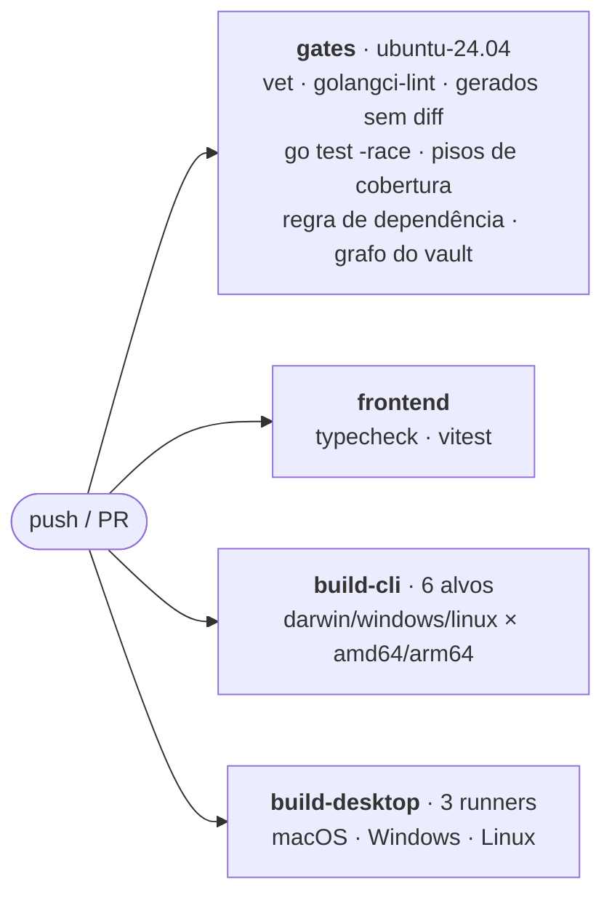
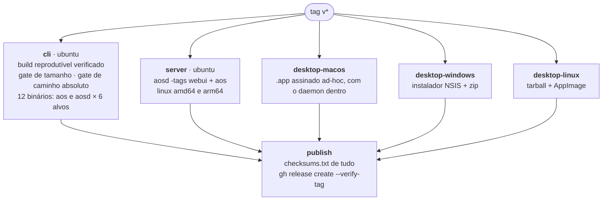

# 10 · Release

> [Índice](../README.md) · Anterior: [Desenvolvimento](09-desenvolvimento.md)

## Versionamento

`vMAJOR.MINOR.PATCH-faseN` — SemVer com o sufixo da fase do
[roteiro](../08%20-%20Entrega/Roteiro%20de%20Fases.md) em que o corte foi
feito. A versão é gravada no binário a partir de `git describe`, junto com o
commit e a data do commit.

```sh
aos version --json
# {"version":"v0.13.0-fase9","commit":"a1b2c3d","date":"2026-08-27T00:00:00Z"}
```

O histórico está no [CHANGELOG](../../CHANGELOG.md).

## CI — todo push e todo PR

`.github/workflows/ci.yml`, quatro jobs:



`gates` roda com `CGO_ENABLED=1` de propósito: o race detector precisa de cgo,
e com ele o `go vet` alcança `cmd/aos-desktop` de verdade — a configuração que
é distribuída, não uma variante headless que ninguém usa.

`build-desktop` compila só a metade Go, contra um `dist/.gitkeep`. O que
realmente é empacotado vem do job de release.

## Release — quando uma tag `v*` é empurrada

`.github/workflows/release.yml`:



### Os gates do artefato

Rodam no job `cli`, a partir do próprio `Taskfile.yml` — os números moram lá,
não no workflow, para os dois não divergirem:

| Gate | O que prova |
|---|---|
| `build:verify-reproducible` | Duas compilações do mesmo commit, com o mesmo `SOURCE_DATE_EPOCH`, são idênticas byte a byte |
| `build:check-size` | `aos` ≤ 36 MB, `aosd` ≤ 54 MB, `aos-desktop` ≤ 66 MB |
| `build:check-no-abspath` | Nenhum binário carrega o diretório home de quem compilou (prova que o `-trimpath` funcionou) |

O carimbo de build vem do timestamp do commit da tag, não do relógio: duas
compilações da mesma tag gravam a mesma data e batem no hash.

## Os artefatos

21 arquivos mais o `checksums.txt`.

| Arquivo | Para quem |
|---|---|
| `AOS-<v>-darwin-arm64.zip` | macOS — o `.app` com o daemon dentro |
| `AOS-setup-<v>-windows-amd64.exe` | Windows — instalador com atalho e desinstalação |
| `AOS-<v>-windows-amd64.zip` | Windows — os três executáveis soltos |
| `AOS-<v>-linux-amd64.tar.gz` | Linux — os três executáveis |
| `AOS-<v>-linux-x86_64.AppImage` | Linux — um arquivo só |
| `AOS-server-<v>-linux-{amd64,arm64}.tar.gz` | VPS — o daemon com a interface dentro |
| `aos_<v>_{darwin,linux,windows}_{amd64,arm64}` | O terminal, por alvo |
| `aosd_<v>_{darwin,linux,windows}_{amd64,arm64}` | O daemon, por alvo |
| `checksums.txt` | `sha256sum -c --ignore-missing checksums.txt` |

Os binários soltos são publicados crus, sem arquivo compactado, de propósito:
o atualizador escreve os bytes de um asset direto como executável e não tem
nada que desempacote um tar ou um zip.

O `install.sh` verifica os checksums e se recusa a instalar quando algo não
confere.

## Cortar uma versão

```sh
# 1. a main tem que estar verde
task check
cd frontend && npm run typecheck && npx vitest run && cd ..

# 2. o CHANGELOG descreve o que mudou
$EDITOR CHANGELOG.md

# 3. a tag, anotada, com a mensagem que aparece no release
git tag -a v0.13.0-fase9 -m "v0.13.0-fase9 — <o que mudou, em uma linha>"
git push origin main
git push origin v0.13.0-fase9

# 4. acompanhar
gh run watch
gh release view v0.13.0-fase9
```

`--verify-tag` no `gh release create`: um release só existe se a tag existir
no repositório remoto.

## O que ainda falta para "binários assinados e instaláveis"

O empacotamento está feito nas três plataformas; a **assinatura** não, e não é
uma questão de código:

- **macOS** — Apple Developer ID para assinar e notarizar. Hoje o bundle é
  assinado ad-hoc (o suficiente para rodar em Apple Silicon, não para eliminar
  o Gatekeeper) e o instalador contorna a quarentena via `curl`.
- **Windows** — certificado de code-signing. Sem ele, o SmartScreen avisa.
- **Auto-update** — o núcleo existe e verifica assinatura Ed25519 e checksum,
  mas o feed está desligado (`AOS_UPDATE_BASE_URL` vazio) e as instalações
  deste beta carregam uma chave de desenvolvimento: quando ela rotacionar,
  será preciso reinstalar uma vez.

Ambos dependem de credenciais que só o dono do projeto pode obter, e o nome
definitivo do produto ([ADR-0000](../01%20-%20Decisões/ADR-0000%20Nome%20provisório%20do%20projeto.md))
vem antes dos dois.

## Quando um release falha

| Job | Falha comum | O que olhar |
|---|---|---|
| `cli` | Build não reprodutível | Algo que lê o relógio ou o ambiente entrou no binário |
| `cli` | Tamanho acima do teto | Uma dependência nova, ou sourcemaps que voltaram ao embed |
| `desktop-linux` | AppImage não sai | O passo é `continue-on-error`: o release sai com o tarball e um aviso |
| `desktop-windows` | `makensis produced no installer` | O NSIS não achou os binários — caminhos relativos, com barra invertida |
| `publish` | `--verify-tag` recusa | A tag não foi empurrada para o remoto |

O AppImage não empacota GTK4 nem WebKitGTK — é um problema em aberto do
ecossistema ([wails#4313](https://github.com/wailsapp/wails/issues/4313)),
não um descuido. Os requisitos do Linux valem para ele igual.

> Voltar ao [índice da documentação](../README.md)
